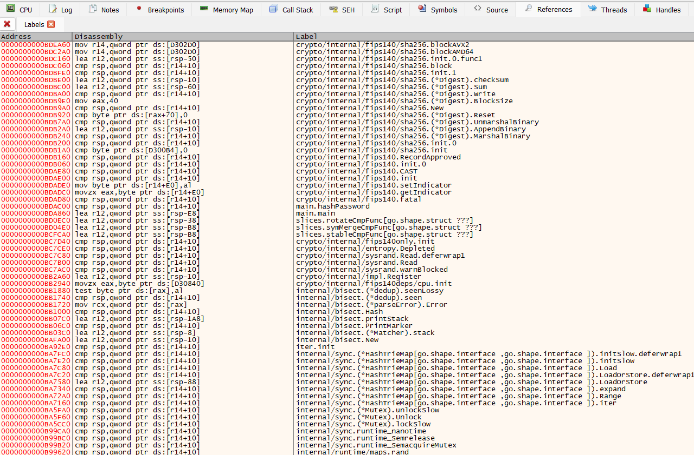

# GoReSym x64dbg Integration Script

This script uses [x64dbg_automate](https://dariushoule.github.io/x64dbg-automate-pyclient/) to enrich a debugee with symbol information provided by [GoReSym](https://github.com/mandiant/GoReSym).

Symbol information is persisted in the x64dbg program database on exit.

## Usage

1. Install `x64dbg_automate` and `GoReSym`.
2. Run `GoReSym` against your target exe, saving output to a JSON file.
3. Run this script:
    ```
    python goresym_x64dbg.py target.exe resym.json <path_to_x64dbg.exe>
    ```
4. The script will automatically apply symbol information from the provided JSON file 🎉

